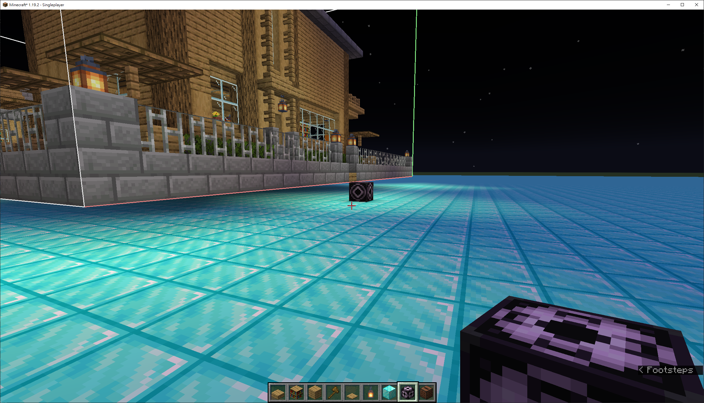

# 建築設計與 Config 使用方法

## 基礎建築設計
1. 使用 structure block
2. 用兩個 structure block 訂定 corner，並命同樣的名字，如: <level1>
3. 接著放一個 structure block 訂定 save，並命與上述同樣的名字
4. 按下 detect，過程中有調整 offset 請點選 done
5. 調整對齊 structure block 的線後，直接按右下的 save

## Config 使用方法 `structures/<name-number>/*.json`

### 架構如下
```json
{
    "Entries": [
        {
            "facing": "",
            "roadStartPosition": [],
            "type": ""
        }
    ],
    "Size": [],
    "Offsets": [],
    "Type": ,
    "Level": ,
    "RequiredResource": {
        "human": ,
        "wood": ,
        "stone": ,
        "food": ,
        "ironOre": ,
        "iron": ,
        "grass": 
    },
    "ProduceResource": {
        "human": ,
        "wood": ,
        "stone": ,
        "food": ,
        "ironOre": ,
        "iron": ,
        "grass": 
    }
}
```

* Entries/facing: 有 "north", "south", "east", "west" 四種，為路口朝向方向。
* Entries/roadStartPosition: 有 `[x, y, z]`，即為路口座標(相對建築起點位置)。
* Entries/type: 目前僅有 "mainEntry"，目的為可能道路網接至此房子時可以有多個入口接點。
* Size: 有 `[x, y, z]`，為此 nbt file 的房子的大小
* Offsets: 為相對於同類型建築最高級的房子 roadStartPosition 的位移。
* Type: 該建築類型，通常以 `<name><type-number>` 命名中的 `<type-number>` 作為 Type。
* Level: 該類型建築的等級。
* RequiredResource: 建立此建築時所需的材料。
* ProduceResource: 此建築的被建立後每一回合的收入。

### 計算 roadStartPosition 的方法

以下圖方法:
1. 先將 nbt file loading 進去後調整成剛好在們前下面的一格，如圖一、二所示。
2. 成功後將圖三的數值 X, Y, Z 紀錄下來，三個乘以 `-1` 後即為 roadStartPosition。





### 計算 Offset 的方法
依照同類建築的最大棟(最高級數)的建築之 `roadStartPosition`，減掉要設定 config 的建築之 `roadStartPosition`，即為要設定 config 的建築之 offset。

舉例: level3 的建築 roadStartPosition 為 `[14, -1, -1]`，level1 為 `[5, -1, -1]`，那 level1 的 offset 為 `[9, 0, 0]`。

